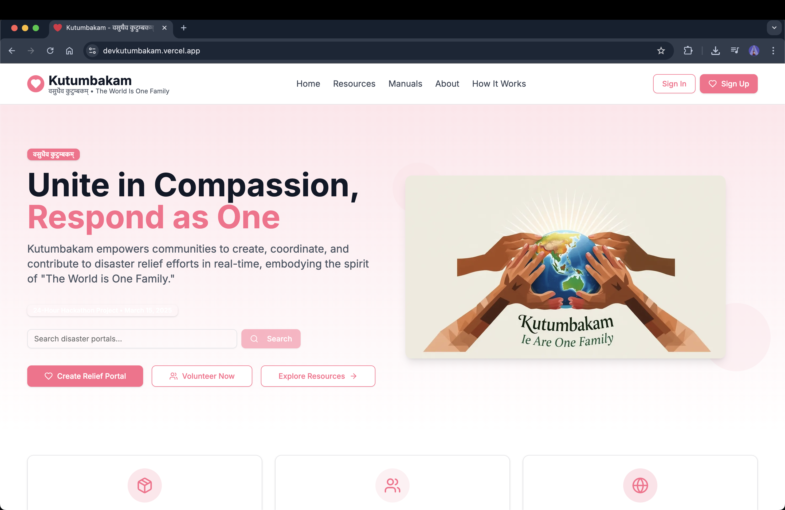
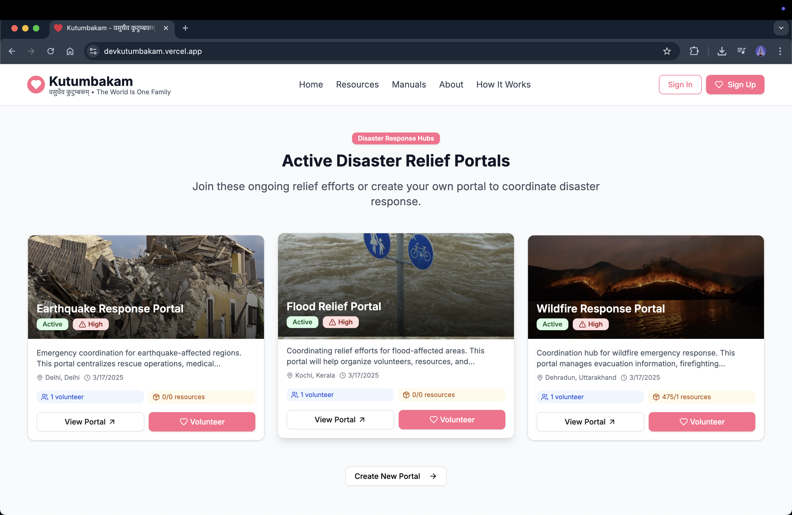
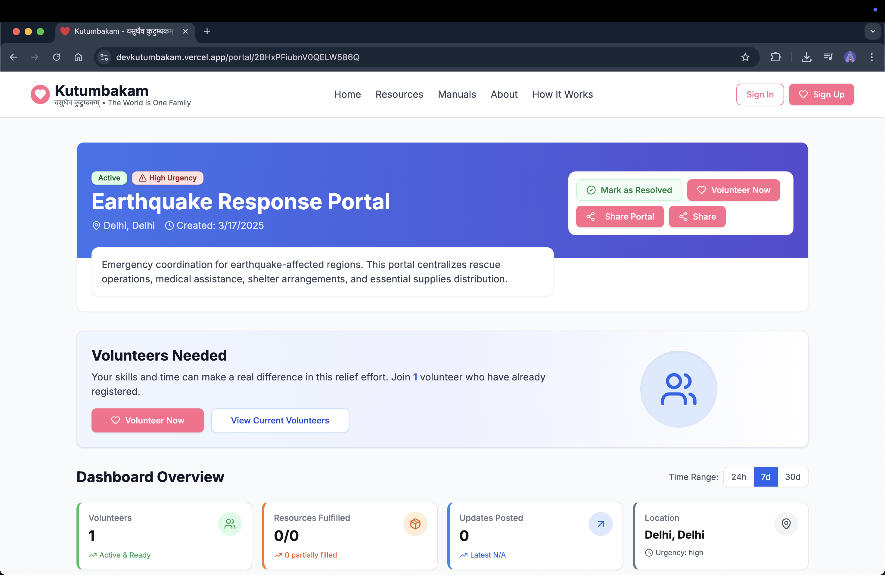
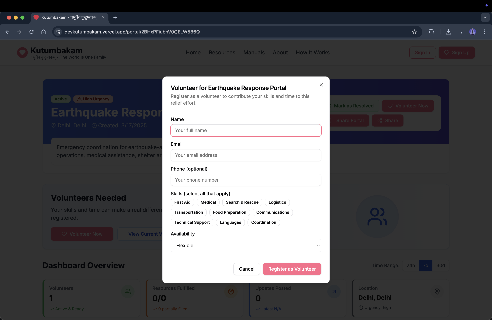

# Kutumbakam - वसुधैव कुटुम्बकम्


A modern, open-source disaster relief coordination portal that empowers anyone to create, share, and contribute to disaster relief efforts, embodying the spirit of "The World is One Family." Built in 24 hours by Manan Goel as a B.Tech CSE project, Kutumbakam unites communities, volunteers, and resources for rapid, transparent, and effective humanitarian response.

[](https://devkutumbakam.vercel.app/)

## Snapshots
         

---

## Overview

Kutumbakam is a full-stack platform for disaster preparedness and response:
- Request and offer assistance after disasters
- Create and manage disaster-specific relief portals
- Access disaster preparedness resources and manuals
- Coordinate volunteers and resource allocation
- Dashboard for managing requests, offers, and updates

---

## Tech Stack

- **Frontend:** [Next.js](https://nextjs.org/) (App Router), [TypeScript](https://www.typescriptlang.org/), [Tailwind CSS](https://tailwindcss.com/)
- **Backend:** [Firebase](https://firebase.google.com/) (Auth, Firestore, Storage)
- **UI:** Shadcn UI components
- **CI/CD & Hosting:** [Vercel](https://vercel.com/)

---

## Features

- **User Authentication:** Secure sign-up, login, and password recovery
- **Request Assistance:** Submit and track disaster-related help requests
- **Create Portal:** Launch custom portals for specific disaster events
- **Dashboard:** Manage and monitor all assistance requests and offers
- **Volunteer Coordination:** Register, manage, and match volunteers
- **Resource Center:** Access disaster preparedness guides and manuals
- **Profile Management:** Update user info and notification preferences
- **Accessibility & Responsive Design:** Optimized for all users and devices

---

## Getting Started

### Prerequisites
- Node.js 18+ and npm
- Firebase account

### Installation

1. **Clone the repository**
    ```bash
    git clone https://github.com/manan0209/devkutumbakam.git
    cd devkutumbakam
    ```
2. **Install dependencies**
    ```bash
    npm install
    ```
3. **Set up Firebase configuration**
    - Create a Firebase project at [firebase.google.com](https://firebase.google.com)
    - Enable Authentication and Firestore
    - Create a `.env.local` file in the root directory with your Firebase credentials:
      ```
      NEXT_PUBLIC_FIREBASE_API_KEY=your_api_key
      NEXT_PUBLIC_FIREBASE_AUTH_DOMAIN=your_auth_domain
      NEXT_PUBLIC_FIREBASE_PROJECT_ID=your_project_id
      NEXT_PUBLIC_FIREBASE_STORAGE_BUCKET=your_storage_bucket
      NEXT_PUBLIC_FIREBASE_MESSAGING_SENDER_ID=your_messaging_sender_id
      NEXT_PUBLIC_FIREBASE_APP_ID=your_app_id
      ```
4. **Run the development server**
    ```bash
    npm run dev
    ```
    Visit [http://localhost:3000](http://localhost:3000) to view the app.

5. **Build for production**
    ```bash
    npm run build
    npm run start
    ```

---

## Project Structure

```
devkutumbakam/
├── app/                  # Next.js app directory (App Router)
│   ├── api/              # API routes (if any)
│   ├── ...routes         # All main pages and feature routes
│   └── layout.tsx        # Root layout and providers
├── components/           # Modular, reusable UI and feature components
├── lib/                  # Firebase config, utilities, context
├── config/               # Site-wide configuration
├── public/               # Static assets and images
├── hooks/                # Custom React hooks
└── ...                   # Config, scripts, etc.
```

---

## Deployment

This application is deployed on Vercel. To deploy your own instance:
1. Fork this repository
2. Set up a Firebase project and obtain API credentials
3. Deploy to [Vercel](https://vercel.com/) and configure environment variables

---

## Contributing

We welcome contributions from everyone! Please read our [CONTRIBUTING.md](CONTRIBUTING.md) for guidelines.

1. Fork the repository
2. Create your feature branch (`git checkout -b feature/YourFeature`)
3. Commit your changes (`git commit -m 'Add some feature'`)
4. Push to the branch (`git push origin feature/YourFeature`)
5. Open a Pull Request

---

## Roadmap

- Mobile app (PWA/native)
- Offline-first support for disaster zones
- Multi-language and localization
- Emergency services API integration
- AI-powered resource matching
- Advanced analytics for relief coordinators

---

## License

This project is licensed under the [MIT License](LICENSE).

---

_Disaster Assistance Portal – Empowering communities in times of need._
